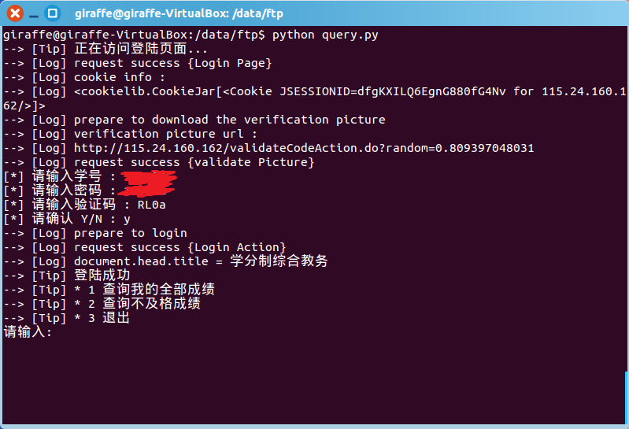
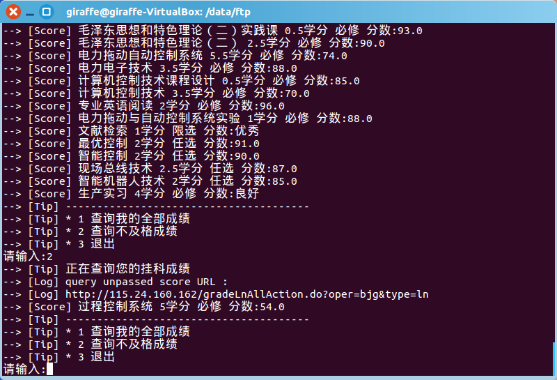

## 河北工业大学教务处 成绩自动查询4python

### 说明

> 自动查成绩 没有什么价值 只是为了学习python 当然你也可以把这个功能加到微信公众号里面]

***

> 需要:beautifulsoup

[点击前往下载](https://pypi.python.org/pypi/beautifulsoup4/4.3.2) https://pypi.python.org/pypi/beautifulsoup4/4.3.2

> 解压安装:

```
tar -zxvf beautifulsoup4-4.3.2.tar.gz
cd beautifulsoup4-4.3.2
sudo python setup.py install
```

> 运行:

`
python query.py
`

***

### 运行结果




